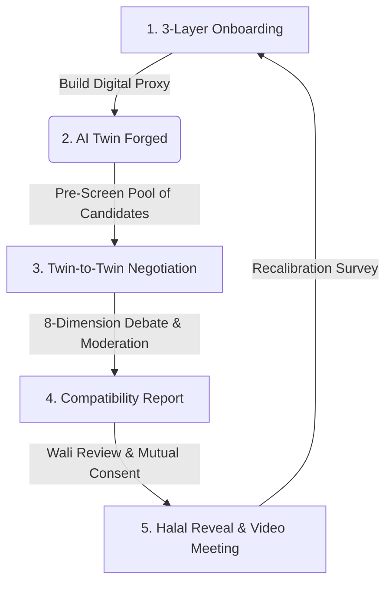

# Lab Viah (RishtaAI) 💍

> **Next-Generation Halal Matchmaking Powered by Agentic AI Twins**  
> *Where values are negotiated by AI proxies, family privacy is absolute, and human connections are deeply intentional.*

---

[](https://expo.dev/)
[](https://reactnative.dev/)
[](https://www.nativewind.dev/)
[](https://github.com/pmndrs/zustand)
[](https://www.typescriptlang.org/)

---

## 🌟 The Vision

Traditional matchmaking apps reduce human connection to shallow, addictive swipe loops, often clashing with traditional and Islamic family boundaries. **Lab Viah (RishtaAI)** flips the script. 

Instead of putting your personal identity, photos, and contact info in a public pool, you create an **AI Twin**—a highly-calibrated, secure digital proxy. Your AI Twin acts as your personal matchmaker, directly debating and negotiating with the AI Twins of potential candidates. It evaluates deep alignment across **8 core life dimensions** before you ever receive a single notification, revealing identities only after mutual interest and family validation are secured.

---

## 🧬 How the App Works: The Agentic Flow



### 1. The 3-Layer Onboarding (Creating Your Twin)
* **Layer 1: Voice Calibration (Natural Nuance):** A relaxed audio introduction prompt that captures not just your words, but your vocal speed, warmth, and Urdu/English language choices.
* **Layer 2: 12 Moral & Cultural Scenarios:** A interactive swipe-card system presenting complex, real-world dilemmas (covering joint family systems, career priorities, child-rearing, and religious practice) to build your dynamic value weights.
* **Layer 3: The AI Interview:** Your twin synthesizes three self-statements ("I value..."). You refine, correct, or approve these statements to lock your finalized Digital Matchmaking Proxy.

### 2. The Twin-to-Twin Debate Engine
When two profiles are pre-screened, their AI Twins enter a private, real-time simulated debate moderated by a Matchmaker Agent. The debate is conducted across **8 Critical Life Dimensions**:
1. 🕋 **Deen (Faith):** Sect alignment, daily practice, and moral baselines.
2. 👨‍👩‍👧 **Family Structure:** Joint vs. nuclear living arrangements, and in-law dynamics.
3. 💼 **Career & Ambition:** Professional growth, workspace values, and dual-income expectations.
4. 💵 **Finances:** Spending, saving habits, and financial responsibilities.
5. 👶 **Children & Parenting:** Raising ideals, timing, and education paths.
6. ⚡ **Conflict Resolution:** Temperament, argumentation style, and problem-solving.
7. 📍 **Geography & Relocation:** Willingness to move, visa constraints, and home base.
8. 🛑 **Dealbreakers & Boundaries:** Explicit non-negotiable boundaries.

### 3. Wali-in-the-Loop & Halal Reveal
Profiles and photographs remain strictly blurred and locked during debates. Once a debate concludes with a high compatibility score, a detailed **Compatibility Report** is generated. The **Wali (Guardian) Dashboard** allows families to review and approve the report before any visual reveal or direct virtual video meetings are unlocked.

---

## 🛠 Technology Stack

This application is built using a modern, production-ready cross-platform mobile frontend architecture:

* **Framework:** [Expo SDK 54](https://expo.dev/) (React Native) with Expo Router/Native-Stack
* **State Management:** [Zustand v5](https://github.com/pmndrs/zustand) (Optimized, lightweight global state hooks)
* **Server State & Cache:** [React Query v5](https://tanstack.com/query/latest) (For robust, declaratively managed data fetching)
* **Styling Engine:** [NativeWind v4](https://www.nativewind.dev/) (Utility-first Tailwind CSS for cross-platform iOS & Android UI)
* **Diagnostics & Safe-Area:** [React Native Safe Area Context ~5.6.0](https://github.com/th3rdwave/react-native-safe-area-context) & [Screens ~4.16.0](https://github.com/software-mansion/react-native-screens)

---

## 📂 Project Structure & Clean Taxonomy

The repository is organized for seamless maintenance, final deployment, and easy readability:

```text
.
├── README.md                      # Main portal & developer guide
├── AGENTS.md                      # AI agent code rules (Expo SDK v54 directives)
├── CLAUDE.md                      # Workspace instructions
├── package.json                   # Project packages & Expo settings
├── tsconfig.json                  # Strict TypeScript compiler options
│
├── docs/                          # Organized Project Documentation
│   ├── specifications/            # Product definitions & endpoint definitions
│   │   ├── product_requirements_document.md
│   │   └── api_documentation.md
│   │
│   ├── planning/                  # Sprint roadmaps & UI guidelines
│   │   ├── frontend_implementation_plan.md
│   │   ├── ui_consistency_plan.md
│   │   └── ui_navigation_audit.md
│   │
│   └── development/               # Developer internal notes & guides
│       ├── developer_instructions.md
│       ├── development_context.md
│       ├── progress_tracking.md
│       └── ai_agent_skill.md
│
├── scripts/                       # Reusable build & hotfix tools
│   ├── fix-imports.js             # NativeWind/safe-area absolute resolution
│   └── fix-safearea-all.js        # Safe-area layout injection script
│
└── src/                           # Pure source code
    ├── api/                       # Query providers & 12-candidate mock database
    ├── components/                # Reusable UI elements (SafeScreen, AgTrace, InputField)
    ├── navigation/                # Multi-stack navigators & route parameter typings
    ├── store/                     # Global Zustand application state (useAppStore.ts)
    └── screens/                   # Flat list of the 16 functional screens
```

To explore our structured specs, audits, and planning files, navigate through our [Documentation Directory](./docs).

---

## 🚀 Running the App Locally

Get the local development server up and running on your physical device or emulator in minutes.

### Prerequisites
* [Node.js](https://nodejs.org/) (v18 or newer recommended)
* npm or yarn
* **Expo Go** application installed on your physical iOS/Android phone (available on the App Store / Google Play).

### Step-by-Step Setup

1. **Clone the repository:**
   ```bash
   git clone https://github.com/muhammad-jawad-ali/vab-viah.git
   cd vab-viah
   ```

2. **Install exact, compatible dependencies:**
   ```bash
   npm install
   ```

3. **Start the development server:**
   ```bash
   npx expo start
   ```

4. **Launch the interface:**
   * **Physical Device:** Open your camera and scan the QR code printed in the terminal (Requires the Expo Go app).
   * **iOS Simulator:** Press `i` in the terminal (Requires Xcode setup on macOS).
   * **Android Emulator:** Press `a` in the terminal (Requires Android Studio setup).

---

## 🔒 Production Readiness & Quality Checklist

We enforce strict validation checks to ensure that the mobile app works flawlessly and builds reliably for production distribution (iOS App Store `.ipa` / Google Play Store `.aab`):

### 1. Offline Type Verification
Check for any TypeScript, syntax, or broken absolute path errors:
```bash
npx tsc --noEmit
```
*Status: ✅ **Passed** with 0 errors.*

### 2. Dependency Alignment & SDK Check
Verify that all third-party native packages map correctly with Expo SDK 54 specifications:
```bash
npx expo-doctor
```
*Status: ✅ **Passed** with 100% dependency compatibility.*

### 3. Production Compilation Bundling
Simulate a production build bundling pass (bundles 1200+ index modules using Metro):
```bash
EXPO_NO_TELEMETRY=1 npx expo export
```
*Status: ✅ **Passed** with successful iOS & Android output generated in `/dist`.*

### 4. Triggering App Binaries (EAS Build Pipeline)
To generate the final installation packages in the cloud:
```bash
# Authenticate with your EAS account
npx eas-cli login

# Build binaries
npx eas build --platform all
```

---

## ⚠️ Key Showcase Design Elements

* **AG-TRACE Logs:** You will notice an animated `AG-TRACE` logs strip running across agentic screens (e.g. Twin Onboarding and Twin Debate screens). This displays simulated autonomous decision logs of the AI agents negotiating behind the scenes, highlighting the backend’s processing.
* **Consent-Driven Avatars:** Every avatar is blurred by default with a `blurRadius` of 12. Photos are only rendered after mutual consent and Wali verification, honoring traditional privacy principles.
* **Harmonious Luxury Aesthetic:** Built on a premium, near-black slate backdrop (`#0f1117`) paired with a vibrant, welcoming emerald color palette (`#10b981`) to offer a premium, state-of-the-art matrimonial experience.

---

*Developed with pride by muhammad-jawad-ali* 💍
