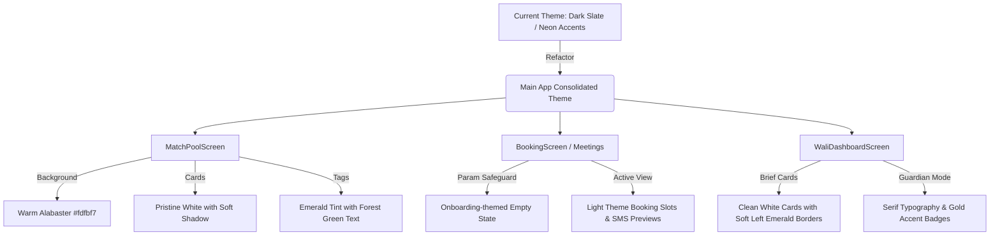

# Implementation Plan: Lab Viah UI/UX Consistency & Crash Resolution

This implementation plan details the strategy to unify the aesthetics of the entire Lab Viah application. Currently, there is a major visual disconnect: the onboarding flow has a stunning, premium, warm alabaster (`#fdfbf7`) and deep emerald (`#064e3b`) luxury aesthetic, while the main dashboard screens (Matches, Meetings, Wali) default to a dark-theme slate layout, and the bottom tab navigator displays as a plain white bar with basic triangles.

Additionally, this plan addresses the `TypeError: Cannot read property 'matchId' of undefined` crash occurring when the "Meetings" button is clicked directly from the bottom tab bar.

---

## 🎨 1. Theme & Design System Alignment

We will enforce the onboarding design language across all main tabs. The core color tokens defined in `tailwind.config.js` will be used:

| Token | Color Hex | CSS Class (Tailwind) | Use Case |
| :--- | :--- | :--- | :--- |
| **Primary** | `#064e3b` | `bg-primary` / `text-primary` | Main buttons, active tab states, section highlights |
| **Primary Light** | `#059669` | `bg-primary-light` / `text-primary-light` | Accent borders, secondary text highlight |
| **Primary Dark** | `#022c22` | `bg-primary-dark` / `text-primary-dark` | Hero banners, high contrast cards |
| **Secondary** | `#d4af37` | `bg-secondary` / `text-secondary` | Gold accents, compatibility scores, luxury touches |
| **Background** | `#fdfbf7` | `bg-background` | Screen backdrops (Warm Alabaster) |
| **Surface** | `#ffffff` | `bg-surface` | Card backgrounds, inputs, dropdown items |

### Typography Guidelines
- **Headings**: Use `font-serif` (Georgia) with `text-slate-900` for primary page headers.
- **Labels / Sub-headers**: Use `font-bold text-[10px] text-primary uppercase tracking-widest` for section metadata.

---

## 🧭 2. Redesigning the Bottom Tab Navigator (`AppNavigator.tsx`)

We will transform the bottom tab navigator from its current harsh white background and default triangles into an elegant, warm-toned component that feels cohesive with the onboarding flow.

### A. Custom SVG Minimal Icons
Since the project does not import external icon packages in `dependencies`, we will build **4 custom, ultra-lightweight SVG components** directly inside `AppNavigator.tsx`:
1. **Matches (Discover)**: Minimal overlapping circles (Venn diagram representing matched souls).
2. **Meetings**: Clean minimal calendar card with a clock hand.
3. **Wali**: A sleek protection shield with a heart accent.
4. **Profile**: A refined user outline with geometric spacing.

### B. Tab Style Changes
- Change the background to match either the Warm Alabaster background (`#fdfbf7`) or a pristine white with a very soft golden/green tint border (`#064e3b/10`).
- Use `tabBarActiveTintColor: '#064e3b'` (Deep Emerald) and `tabBarInactiveTintColor: '#94a3b8'` (Muted Slate).

```tsx
// Proposed Tab Navigator configuration
<Tab.Navigator
  screenOptions={{
    headerShown: false,
    tabBarStyle: {
      backgroundColor: '#fdfbf7',
      borderTopColor: 'rgba(6, 78, 59, 0.1)', // Subtle primary green border
      height: 64,
      paddingBottom: 10,
      paddingTop: 8,
      shadowColor: '#064e3b',
      shadowOffset: { width: 0, height: -4 },
      shadowOpacity: 0.04,
      shadowRadius: 12,
      elevation: 8,
    },
    tabBarActiveTintColor: '#064e3b',
    tabBarInactiveTintColor: '#94a3b8',
    tabBarLabelStyle: {
      fontFamily: 'System',
      fontSize: 10,
      fontWeight: '700',
      letterSpacing: 0.5,
    }
  }}
>
```

---

## 🛠️ 3. Fixing the Meetings Screen Crash (`BookingScreen.tsx`)

### The Cause
In `AppNavigator.tsx`, the first screen of the `MeetingsTab` stack is `BookingScreen.tsx`.
When the user clicks the "Meetings" tab directly, React Navigation renders `BookingScreen`, which executes:
```tsx
const { matchId, matchName } = route.params;
```
Because no match was selected, `route.params` is `undefined`, leading to the `TypeError` crash.

### The Resolution
1. **Safe Destructuring**: Fallback to an empty object.
   ```tsx
   const { matchId, matchName } = route.params || {};
   ```
2. **Elegant Onboarding Empty State**: If `matchId` is missing, instead of crashing, we render a highly polished, onboarding-style empty state that guides the user back to discovery.

```tsx
if (!matchId) {
  return (
    <View style={{ paddingTop: insets.top }} className="flex-1 bg-background justify-center items-center px-8">
      <View className="w-20 h-20 bg-primary/5 rounded-full items-center justify-center mb-6 border border-primary/10">
        <Text className="text-4xl text-primary">📅</Text>
      </View>
      <Text className="text-2xl font-serif font-bold text-slate-900 text-center mb-2">No Active Booking</Text>
      <Text className="text-slate-500 text-sm text-center mb-8 leading-relaxed">
        Select a profile from your Match Pool, initiate a Halal Reveal, and schedule your moderator-guided conversation.
      </Text>
      <TouchableOpacity
        onPress={() => navigation.navigate('DiscoverTab')}
        className="bg-primary px-8 py-4 rounded-xl shadow-lg shadow-primary/20"
      >
        <Text className="text-surface font-bold text-xs tracking-widest uppercase">Explore Matches ➔</Text>
      </TouchableOpacity>
    </View>
  );
}
```

---

## 🖼️ 4. Screen-by-Screen Aesthetic Remodeling

Here is the step-by-step styling transformation required for the four tabs of the main dashboard:



### A. MatchPoolScreen.tsx (Matches Tab)
- **Background**: Replace `bg-[#0f1117]` with `bg-background`.
- **AG-Trace Strip**: Keep this key feature, but transform its colors into a refined, high-end light style:
  `bg-emerald-950/5 border-b border-emerald-900/10` with `text-emerald-800` text.
- **Header**:
  - Subtitle: `text-primary font-bold text-[10px] uppercase tracking-[0.25em]`.
  - Title: `text-slate-900 font-serif text-4xl font-bold mt-1`.
  - Count Badge: `bg-primary/5 border border-primary/20 text-primary`.
- **Match Cards**:
  - Replace `bg-[#1e293b] border-white/5` with `bg-surface border border-slate-200/80 shadow-sm rounded-3xl`.
  - Change matching title text to `text-slate-900 font-bold`.
  - Category tags: Replace `bg-[#0f172a] border-emerald-800/40 text-emerald-400` with `bg-emerald-50 border border-emerald-100 text-emerald-800`.
- **Baseline Comparison Banner**:
  - Replace amber-dark background with `bg-amber-50 border border-amber-200/60 p-5 rounded-2xl`.
  - Text: `text-amber-800`.

### B. BookingScreen.tsx (Meetings Tab)
- **Background**: Replace `bg-[#0f1117]` with `bg-background`.
- **Safe Area & AG-Trace**: Set theme to light-emerald like the Match Pool.
- **Slots Components**:
  - Inactive: `bg-surface border border-slate-200/80` with `text-slate-800` title and `text-slate-500` details.
  - Active: `bg-primary/5 border-primary` with `text-primary` title and `text-primary-light` details.
- **SMS Preview Block**:
  - Replace deep-dark slate with `bg-slate-50 border border-slate-100 p-4 rounded-2xl`.
  - Change preview text to `text-slate-600 italic`.
- **CTA Button**:
  - Inactive: `bg-slate-200` with `text-slate-400`.
  - Active: `bg-primary` with `text-surface` (Deep Emerald/Gold Theme).

### C. WaliDashboardScreen.tsx (Wali Tab)
- **Background**: Replace `bg-[#0f1117]` with `bg-background`.
- **Guardian Protocol Banner**:
  - Replace deep-dark slate with `bg-primary-dark p-5 rounded-3xl shadow-xl`.
  - Keep text as `text-surface` and `text-primary-light` for rich contrast, matching the Settings screen's main profile card.
- **Pending Brief Cards**:
  - Replace dark cards with `bg-surface border border-slate-200/80 shadow-sm rounded-[32px] p-6`.
  - Applicant Name: `text-slate-900 font-serif text-xl font-bold`.
  - Compatibility badge: `bg-secondary/10 border border-secondary/30 text-secondary-dark` (Gold).
  - Left brief border: Make it a gorgeous `border-l-4 border-primary/30 pl-4`.
- **Wali Actions**:
  - Approve Button: `bg-primary text-surface`.
  - Decline Button: `border border-rose-200 bg-rose-50/50 text-rose-700`.

### D. Settings & Profile Setup Alignment
- **SettingsScreen.tsx**: Already conforms well to `bg-background` and `bg-surface` cards, but verify that any custom gray lines use `border-slate-100` and all typography uses the premium `font-serif` for titles.
- **BasicProfileSetup.tsx**: Replace `bg-slate-50` with `bg-background` to ensure a consistent, elegant warm alabaster page context everywhere.

---

## 📋 5. Implementation Roadmap & Checklist

To achieve full cohesion without risking regression, the following file updates are scheduled:

1. [ ] **Update `src/navigation/AppNavigator.tsx`**:
   - Refactor `MainTabs` styles (Warm Alabaster color palette).
   - Implement custom inline SVG component rendering for `tabBarIcon`.
2. [ ] **Refactor `src/screens/BookingScreen.tsx`**:
   - Implement safe params extraction (`route.params || {}`).
   - Add elegant onboarding-style "Empty State" component.
   - Refactor booking slots, headers, and SMS preview container to the light warm theme.
3. [ ] **Refactor `src/screens/MatchPoolScreen.tsx`**:
   - Transform background to `bg-background`.
   - Remodel MatchCard into light `bg-surface` cards with soft shadow and green tags.
   - Update baseline comparison block.
4. [ ] **Refactor `src/screens/WaliDashboardScreen.tsx`**:
   - Remodel screen backdrop and Guardian Mode banners.
   - Transform pending rishta cards to light theme briefs with a gold badge.
5. [ ] **Verify Navigation & State Stability**:
   - Click "Meetings" from the tab bar: verify empty state renders beautifully without crashes.
   - Initiate a booking from `CompatibilityReportScreen`: verify Booking Screen loads correct parameters and lets the user schedule a slot successfully.
   - Verify that Wali Mode and Settings transitions remain fully operational.

---

### 💬 Verification Notes & Next Steps
We will prioritize absolute aesthetic excellence. Each interface screen will look clean, premium, and fully consistent with the luxury halal matchmaking framing.

**Please review this plan. Upon your approval, we will begin making these precise visual edits to unify the Lab Viah application's interface!**
