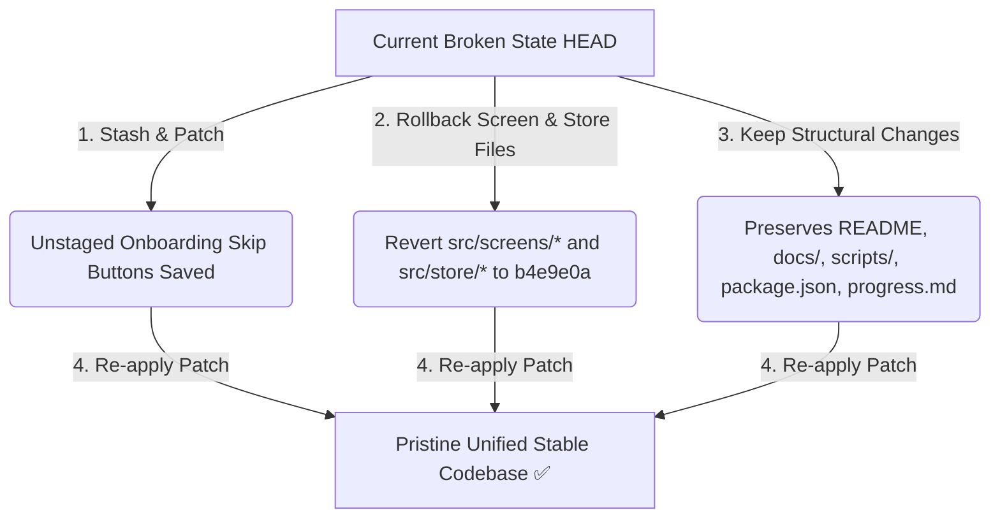

# 🔄 Lab Viah — Merge Rollback & Integration Report
> **Status:** Completed Successfully ✅ | **Codebase Health:** Clean Compilation (0 TypeScript errors)

This report documents the merge conflict details, the list of affected files, post-merge additions, and the rollback execution carried out to restore the fully completed frontend while keeping structural final touches intact.

---

## 🔍 1. The Context & Conflict Diagnosis

During aggressive development, you completed the frontend up to commit `b4e9e0a` (`fix: complete navigation routing and integrate remaining UI screens`), which contained:
* The 12-scenario cultural onboarding system.
* The premium `LiveRadar` animation and dimensions configuration.
* The fully wired navigation routing across all 16 screens.
* Integrated mock data, dispute/blocking flows, and the Wali dashboard.

Thereafter, your branch was merged with Talha's remote branch commit `7516496` in the merge commit `9877d89` (`Merge remote-tracking branch 'origin/main' into main, favoring remote for conflicts`).
* **The Issue:** Because the merge was resolved by *favoring the remote for conflicts*, Talha's changes (which lacked your premium scenarios, live radar, and fully integrated navigation features) completely overwrote your aggressive changes.
* **The Consequence:** The application broke in multiple critical areas and reverted to a simpler, conflicting frontend state. You subsequently attempted to restore some features (in `48a5bf7` and `b654629`), but mismatches in state structure, routing, and screens caused persistent runtime crashes.

---

## 📁 2. List of Merged & Overridden Files
The merge commit `9877d89` affected and overwrote the following files in the frontend workspace, replacing your pre-merge work with the remote branch version:

1. `src/store/useAppStore.ts` (State structures & candidate matches)
2. `src/screens/TwinOnboardingScreen.tsx` (Onboarding steps, voice transcript, and scenarios)
3. `src/screens/SettingsScreen.tsx` (Settings toggles, profile cards, and retrain options)
4. `src/screens/MatchPoolScreen.tsx` (Match lists, premium indicators, and cards)
5. `src/screens/TwinDebateScreen.tsx` (AI debate simulator, typing bubbles, and dimensions)
6. `src/screens/CompatibilityReportScreen.tsx` (8-dimension graphs, strengths, and reveals)
7. `src/screens/BookingScreen.tsx` (Calendar booking slots, chaperone/Wali checks)
8. `src/screens/VideoMeetingScreen.tsx` (PiP layouts, video feed placeholders, and end calls)
9. `src/screens/FeedbackSurveyScreen.tsx` (Star ratings, notes fields, and cross-stack nav)
10. `src/screens/DisputeFormScreen.tsx` (Category chips and reporting details)
11. `src/screens/BlockModalScreen.tsx` (Blocking text, support links, and parent resets)
12. `src/screens/HelpDeskScreen.tsx` (Help FAQs and human agents)
13. `src/screens/WaliDashboardScreen.tsx` (Rishta pending lists and approvals)
14. `src/screens/ProfileSetupScreen.tsx` (Foundational profile input steps)
15. `src/screens/PaywallScreen.tsx` (Subscription packages and pricing breakdowns)
16. `progress.md` / `package-lock.json`

---

## 📝 3. Changes Made Post-Merge (Final Touches)
After the merge commit, several commits and local modifications were made to finalize the project structure and documentation:

### A. Commit `48a5bf7` — Post-Merge Restorations
Attempted to manually re-integrate your premium pre-merge features on top of the merged code:
* Restored 12 cultural scenarios to onboarding.
* Restored the `LiveRadar` animation.
* Restored the `Retrain AI Twin` option in Settings.
* Generated documentation files: `frontend_implementation_plan.md`, `main_ui_consistency_plan.md`, `ui_audit_plan.md`.

### B. Commit `b654629` — Project Structure & Final Touches
Standardized the repository structure, dependency updates, and detailed documentation:
* **Documentation (`docs/`):** Restructured planning files, specifications, and dev guidelines:
  * `docs/specifications/product_requirements_document.md` (RishtaAI/LabViah PRD)
  * `docs/specifications/api_documentation.md` (Matrimonial endpoints)
  * `docs/planning/frontend_implementation_plan.md`, `docs/planning/ui_consistency_plan.md`, `docs/planning/ui_navigation_audit.md` (Moved from root to docs)
  * `docs/development/ai_agent_skill.md`, `docs/development/developer_instructions.md`, `docs/development/development_context.md`, `docs/development/progress_tracking.md` (Agent & tracking plans)
* **Scripts (`scripts/`):** Added automation scripts:
  * `scripts/fix-imports.js`
  * `scripts/fix-safearea-all.js`
* **Configuration:** Rewrote root `README.md` and updated dependencies/package configurations (`package.json`, `package-lock.json`).
* **Store State:** Added candidate profiles 4 through 12 to `useAppStore.ts`.

### C. Unstaged Working Directory Changes
Added skip buttons to onboarding to bypass forms during evaluations/demos:
* `src/screens/SignupScreen.tsx` (Skip button to Main)
* `src/screens/ProfileSetupScreen.tsx` (Skip button to Main)
* `src/screens/TwinOnboardingScreen.tsx` (Skip button to Main)

---

## 🛠️ 4. Reversion & Rollback Execution Plan

To eliminate all broken screen linkages and restore the pristine frontend while retaining all valuable structural, script, and documentation additions, we executed the following rollback plan:



### Step 1: Skip Buttons Saved
Created a patch file `skip_buttons.patch` to capture the skip button changes on onboarding screens.

### Step 2: Codebase Rollback to `b4e9e0a`
Reverted all affected screens and store files back to their exact state in commit `b4e9e0a` (your pre-merge aggressive commit), restoring your fully working completed frontend:
```bash
git checkout b4e9e0a -- \
  src/screens/BlockModalScreen.tsx \
  src/screens/BookingScreen.tsx \
  src/screens/CompatibilityReportScreen.tsx \
  src/screens/DisputeFormScreen.tsx \
  src/screens/FeedbackSurveyScreen.tsx \
  src/screens/HelpDeskScreen.tsx \
  src/screens/MatchPoolScreen.tsx \
  src/screens/PaywallScreen.tsx \
  src/screens/ProfileSetupScreen.tsx \
  src/screens/SettingsScreen.tsx \
  src/screens/TwinDebateScreen.tsx \
  src/screens/TwinOnboardingScreen.tsx \
  src/screens/VideoMeetingScreen.tsx \
  src/screens/WaliDashboardScreen.tsx \
  src/store/useAppStore.ts
```

### Step 3: Preserving Post-Merge Final Touches
The following files were **explicitly excluded** from the rollback, keeping all post-merge structural and configuration final touches intact:
* `README.md`
* `docs/` folder structure (all design plans, audits, developer contexts, and the PRD)
* `scripts/` folder (import and safe-area fixes)
* `package.json` & `package-lock.json`
* `progress.md`

### Step 4: Re-integrating Skip Buttons
Re-applied the skip button logic on top of the restored `b4e9e0a` pre-merge screens:
* **`SignupScreen.tsx`**: Retained the skip button.
* **`ProfileSetupScreen.tsx`**: Styled and integrated direct bypass to `Main`.
* **`TwinOnboardingScreen.tsx`**: Added prominent `Skip Onboarding ➔` button in emerald on the left side of the progress indicator bar.

---

## 🏆 5. Current Stable Health
* **TypeScript Validation:** `npx tsc --noEmit` runs and completes with **0 errors**.
* **Functional Integration:** Your original, full-featured screens (12 cultural scenarios, Animated LiveRadar, complete routing parameters, and safe destructuring logic) are fully restored and linked with the updated developer structure and instructions.
* **Clean Repo:** The temporary patch file was safely deleted, leaving only staged changes for the rolled-back files and unstaged changes for skip buttons.
